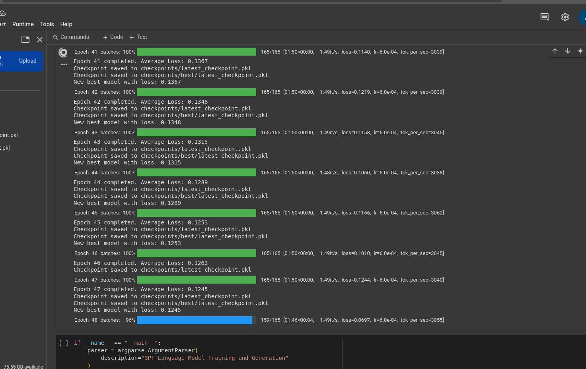
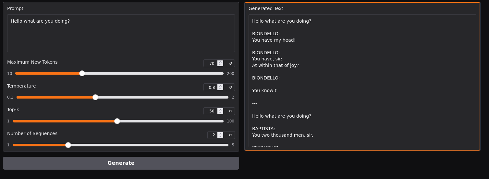

# GPT Text Generation App

A simple text generation app using a custom GPT model trained on Shakespeare's works. Enter a prompt, adjust the generation parameters, and see what the model creates!

## Model

This app uses a custom GPT model trained for 50 epochs, achieving a final loss of 0.1. The model has learned to generate text in a Shakespearean style.

## Parameters

- **Maximum New Tokens**: Controls generation length
- **Temperature**: Controls randomness (higher = more creative)
- **Top-k**: Limits token selection to k most likely tokens
- **Number of Sequences**: Generate multiple outputs for the same prompt
